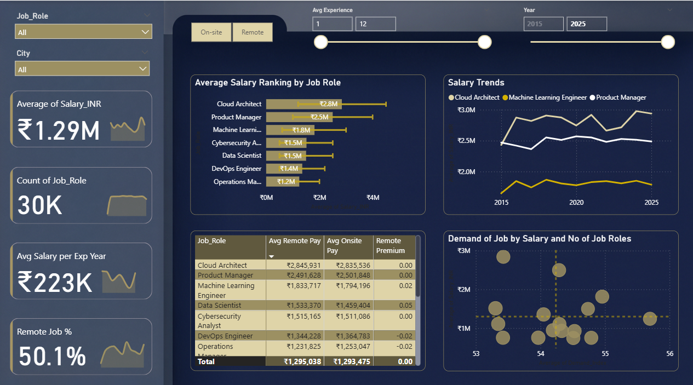

# Indian Job Market Analysis (2015-2025)

**Project Description:** I analyzed a decade of hiring data using **Excel & Power BI** to decode salary benchmarks. The interactive dashboard reveals a 30% "Tech Premium" in Bangalore and tracks the shift of remote work from a general perk to a senior-only privilege. Empowers job seekers with data-driven career ROI insights.

## ⚙️ Project Type Flags
- [x] Exploratory Data Analysis (EDA)
- [ ] SQL Analysis / Querying
- [x] Dashboard / Data Visualization
- [ ] Data Pipeline / ETL
- [ ] Predictive Modelling / Machine Learning
- [x] Data Cleaning / Wrangling
- [ ] End-to-End (multiple of the above)

## Table of Contents
- [1. Project Overview](#1-project-overview)
- [2. Objectives](#2-objectives)
- [3. Project Scope & Tools](#3-project-scope--tools)
- [4. Repository Structure](#4-repository-structure)
- [5. Data Workflow](#5-data-workflow)
- [6. Data Model & Schema](#6-data-model--schema)
- [8. Analysis & Metrics](#8-analysis--metrics)
- [9. Key Insights](#9-key-insights)
- [10. Recommendations](#10-recommendations)
- [11. Assumptions & Limitations](#11-assumptions--limitations)
- [12. Future Enhancements](#12-future-enhancements)
- [13. Deliverables](#13-deliverables)
- [14. Author](#14-author)

---

## 1. Project Overview
**Context:** The Indian job market has undergone massive transformations between 2015 and 2025, driven by the tech startup boom and post-pandemic remote work shifts.
**Problem Statement:** Job seekers and HR leaders lack data-driven clarity on which roles offer the best "Return on Experience," and whether remote work is a fading trend or a permanent fixture.
**Approach:** I extracted and cleaned 10 years of hiring data using Excel, engineering custom metrics like "Salary per Year of Experience," and visualized the findings through an interactive Power BI dashboard.
**Outcome:** Delivered an executive dashboard that quantifies the "Bangalore Tech Premium" and proves that remote work has transitioned from a standard perk to a seniority-based privilege.

## 2. Objectives
- **Primary Objective:** Quantify salary disparities across different experience levels, cities, and job roles in the Indian corporate sector.
- **Secondary Objective 1:** Analyze the correlation between market demand (`Demand_Index`) and actual compensation.
- **Secondary Objective 2:** Track the lifecycle and current state of "Remote Work" adoption.

## 3. Project Scope & Tools

### Scope
| Dimension | Details |
| :--- | :--- |
| **In Scope** | Corporate hiring records across major metros (Bangalore, Mumbai, Delhi, Hyderabad), covering Tech, Management, and HR roles. |
| **Out of Scope** | Gig economy, freelance data, and the informal employment sector. |
| **Time Period** | 2015 - 2025 |
| **Granularity** | Individual job posting/hiring record level. |

### Tools & Technologies
| Category | Tool(s) Used |
| :--- | :--- |
| **Data Processing** | Excel, Power Query (Data cleaning, handling missing values) |
| **Analysis** | Excel Pivot Tables, DAX Measures |
| **Visualization** | Power BI, PowerPoint |
| **Version Control** | Git / GitHub |

## 4. Repository Structure

    Indian-Job-Market-Analysis/
    │
    ├── data/
    │   ├── raw/                  # Original Job_Market_India.csv
    │   └── processed/            # Cleaned data with engineered features
    │
    ├── reports/                  
    │   ├── Job Market in India D.PPTX   # Executive slide deck
    │   └── Job market in india.pbix     # Power BI Dashboard file
    │
    ├── visuals/                  
    │   └── dashboard_main.png           # Exported dashboard screenshots
    │
    └── README.md                 # You are here

## 5. Data Workflow

1. **Source:** `Job_Market_India.csv` (Corporate hiring records, 2015-2025).
2. **Cleaning (Excel/Power Query):** Standardized company names (e.g., merging "Swiggy" variants), formatted dates, and validated salary integers.
3. **Transformation:** Engineered new fields:
   - `Salary_per_Year` = `Salary_INR` / `Avg Experience`
   - `Remote_Option_Flag` (Binary 1/0 for DAX aggregations)
4. **Analysis (Power BI):** Developed DAX measures to calculate Year-over-Year salary trends and average Demand Index by city.
5. **Output:** An interactive Power BI dashboard and an executive PowerPoint summary.

## 6. Data Model & Schema

**Table:** `Job_Market_Data`

| Field Name | Data Type | Description | Example Value |
| :--- | :--- | :--- | :--- |
| `Record_Date` | Date | The date the job data was recorded | 2025-11-17 |
| `Company_Name` | String | Hiring organization | Swiggy |
| `Job_Role` | String | Position title | Data Scientist |
| `Experience_Level`| String | Seniority bracket | 0-1 years |
| `Salary_INR` | Integer | Annual CTC in Indian Rupees | 2074437 |
| `Demand_Index` | Integer | Hiring volume score (0-100) | 83 |
| `Remote_Option_Flag`| Integer | 1 = Remote/Hybrid, 0 = On-site | 1 |
| `Salary_per_Year` | Float | Calculated ROI metric | 414887.4 |

## 8. Analysis & Metrics

**Analytical Approach:**
Instead of just looking at average salaries, I engineered a `Salary_per_Year_of_Experience` metric. This normalized the data, allowing a fair comparison between a high-paying senior role and a rapidly scaling junior role.

**Key Metrics Defined:**
| Metric | Plain-Language Definition | Why It Matters |
| :--- | :--- | :--- |
| **Salary per Year of Exp.** | Earnings divided by years worked. | Identifies "High ROI" career paths regardless of total seniority. |
| **Demand Index** | A normalized score based on posting volume. | Distinguishes between "High Volume" and "High Value" jobs. |
| **Remote Penetration %** | Percentage of roles offering remote options. | Tracks flexible work trends vs. Return-to-Office mandates. |

## 9. Key Insights

**Insight 1: The "Bangalore Premium" is Real**
Bangalore consistently outpays other metros by 20-30% in Tech. Data shows that a Data Scientist in Bangalore earns an average of ₹20.7 LPA, whereas similar roles in Mumbai or Delhi average significantly lower. The startup concentration creates a unique, hyper-competitive wage tier.

**Insight 2: Remote Work is a "Seniority Privilege"**
Remote options have vanished for entry-level roles but increased for leadership. By 2025, entry-level roles show a near 0% Remote Flag (mandatory on-site), while Senior-level roles (12+ years) retain high remote availability. Flexibility is now a retention tool for veterans, not a standard perk.

**Insight 3: High Demand ≠ High Salary**
Roles like "HR Manager" show a "Very High" Demand Index (85/100) but fall into the Moderate Salary Tier. Conversely, "Product Managers" have lower posting volumes but the highest *Salary per Year of Experience* ratio, proving that skill scarcity drives pay far more than sheer hiring volume.

## 10. Recommendations

| Priority | Recommendation | Based On | Suggested Owner |
| :--- | :--- | :--- | :--- |
| **High** | **Target Tier-2 Hubs:** Source mid-level tech talent in Pune/Hyderabad where salaries are ~15% lower than Bangalore but skill availability remains high. | Salary vs. City Analysis | Talent Acquisition |
| **Medium** | **Leverage Senior Remote Work:** Formalize "Hybrid-for-Juniors, Remote-for-Seniors" to poach top leadership talent without inflating base pay. | Remote Work Seniority Gap | HR Leadership |
| **Low** | **Re-evaluate Non-Tech Pay Scales:** Address the widening gap between Operations and Tech compensation to mitigate attrition risks in support departments. | Salary Tier Divergence | Comp & Benefits |

## 11. Assumptions & Limitations

**Assumptions:**
- `Salary_INR` represents the total Cost to Company (CTC), inclusive of standard bonuses.
- Experience ranges (e.g., "0-1 years") were averaged (e.g., 0.5) to enable mathematical division for the ROI metric.

**Limitations:**
- **Informal Sector:** The dataset focuses strictly on corporate/formal employment.
- **Inflation:** Salaries are nominal and not adjusted for inflation over the 2015-2025 period.
- **Demographics:** The dataset lacks gender and demographic breakdowns, preventing pay equity analysis.

## 12. Future Enhancements
- [ ] **Inflation Adjustment:** Integrate CPI data to visualize "Real Wage" growth vs. "Nominal Wage" growth.
- [ ] **Skill Extraction:** Use NLP to parse job descriptions and correlate specific tools (e.g., Python, AWS) with salary premiums.

## 13. Deliverables

| Deliverable | Description | Location |
| :--- | :--- | :--- |
| **Power BI Dashboard** | Interactive .pbix file with full DAX model | `/reports/Job market in india.pbix` |
| **Executive Presentation** | Slide deck summarizing the business case | `/reports/Job Market in India D.PPTX` |
| **Cleaned Dataset** | The final transformed dataset | `/data/processed/` |

## 14. Author
**Asif khan** -
Data Analyst

🔗 [LinkedIn](www.linkedin.com/in/asif-khan-234009176)
💼 [GitHub](https://github.com/Asif-khan-mf)
📧 Asifkhanmf@gmail.com
